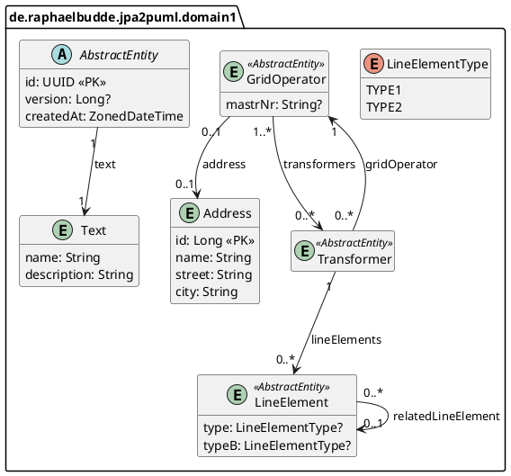
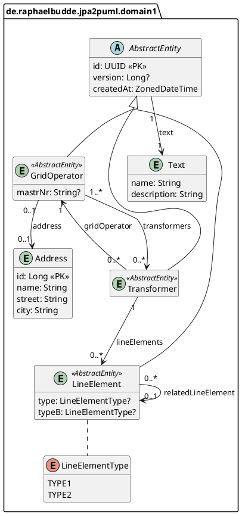

# jpa2puml ⛁ ⇢ 🌱 

`jpa2puml` is a simple command-line tool to
generate [PlantUML Class Diagrams](https://plantuml.com/class-diagram) (**puml**)
from `.class` or `.jar` files.
It uses [Java Persistence API](https://plantuml.com/class-diagram) (**JPA**) Annotations to find the relations between
Entities. It can also generate `png`, `svg` or `txt` diagrams using a local `plantuml` installation.

`jpa2puml` unterstands the following `javax/persistence/*` and `jakarta/persistence/*` Annotations:

- `@Entity`
- `@Embeddable` and `@Embedded`
- `@MappedSuperclass`
- `@Column`, `@Column(nullable = false)`, `@Column(nullable = false)`
- `@Id`
- `@OneToOne`
- `@OneToMany`
- `@ManyToOne`
- `@ManyToMany`
- `@JoinColumn`, `@JoinColumn(nullable = true)`,  `@JoinColumn(nullable = false)`
- `@Enumerated`


## Usage

```
Usage: jpa2puml [<options>] <fileordirectory>

Options:
  -o, --out=<text>                Output file; - for stdout; e.g. domain.puml write to domain.puml; e.g. domain.png tries to invoke plantuml and render png. Supported formats: png, svg, pdf, txt, puml
  --txt                           Default renderer txt
  -i, --inheritance-arrow         Draw a line to parent class
  -e, --enum-arrow                Draw a line from class to used enums
  --excluded-directories=<value>  Excluded directories with the given Regex
  --excluded-files=<value>        Excluded class files with the given Regex
  --excluded-classes=<value>      Excluded classes with the given Regex
  --excluded-fields=<value>       Excluded fields with the given Regex
  -v, --verbose                   Verbose
  -V, --version                   Show the version and exit
  -h, --help                      Show this message and exit

Arguments:
  <fileordirectory>  .jar file or a directory with .class or .jar files
```

## Examples

### Generate and print puml from directory with classes

`jpa2puml examples/domain1/target/classes/de/raphaelbudde/jpa2puml`

### Generate and print puml from jar

`jpa2puml examples/domain1/target/examples-domain1-0.0.1-SNAPSHOT.jar`

### Save class diagram as png

`jpa2puml -o images/domain1.png examples/domain1/target/classes/`



### Draw a line to parent class and enums
For some domains, it might be good to visualize inheritance (`-i, --inheritance-arrow`) 
or to visualize the usage of enums (`-e, --enum-arrow`).

`jpa2puml -i -e -o images/domain1-full.png examples/domain1/target/classes/`



### Save class diagram as png and svg

`jpa2puml -o images/domain1.png -o images/domain1.svg examples/domain1/target/classes/`

### Save class diagram png and svg and print it to stdout

`jpa2puml -o images/domain1.png -o - -o images/domain1.svg examples/domain1/target/classes/`

### Print as txt

`jpa2puml -o images/domain1.png -o - --txt examples/domain1/target/classes/`

```
                                                ,------------------------.                    
                                ,-----------.   |AbstractEntity          |   ,---------------.
                                |Transformer|   |------------------------|   |LineElementType|
                                |-----------|   |id: UUID <<PK>>         |   |---------------|
                                |           |   |version: Long?          |   |TYPE1          |
                                `-----------'   |createdAt: ZonedDateTime|   |TYPE2          |
                                                `------------------------'   `---------------'
                                                                                              
                                                                                              
,----------------------.      ,----------------.                                              
|LineElement           |      |GridOperator    |                                              
|----------------------|      |----------------|                                              
|type: LineElementType?|      |mastrNr: String?|                                              
`----------------------'      |name: String?   |                                              
                              `----------------'                                              
                                       |                                                      
                              ,---------------.                                               
                              |Address        |                                               
                              |---------------|                                               
                              |id: Long <<PK>>|                                               
                              |name: String   |                                               
                              |street: String |                                               
                              |city: String   |                                               
                              `---------------'                                               
```


## Installation

### Manual installation

1. build `./mvnw package`
2. copy jar to local share e.g. `cp target/jpa2puml-1.0.0-SNAPSHOT-jar-with-dependencies.jar ~/.local/share`
3. copy script to local bin e.g. `cp bin/jpa2puml ~/.local/bin`
4. edit `~/.local/bin/jpa2puml` change path to the jar location
   e.g. `~/.local/share/jpa2puml-1.0.0-SNAPSHOT-jar-with-dependencies.jar`
5. test via `jpa2puml -V`


## Release
1. `./mvnw release:prepare && ./mvnw release:clean`
2. Edit release notes in github


## Authors

[Raphael Budde](https://github.com/raphaelbudde)


## Roadmap and Ideas:
- [ ] use Information Engineering Diagram format https://plantuml.com/ie-diagram
- [ ] handle `@IdClass` and `@EmbeddedId`
- [ ] include plantuml in jar
- [ ] maven plugin
- [ ] gradle plugin

